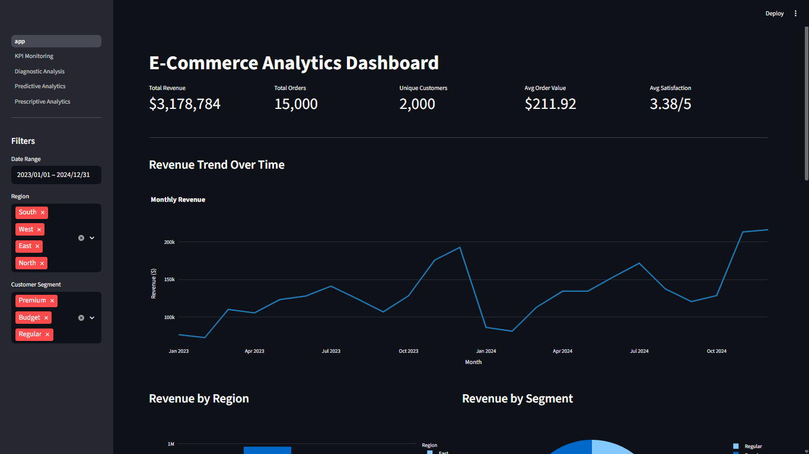
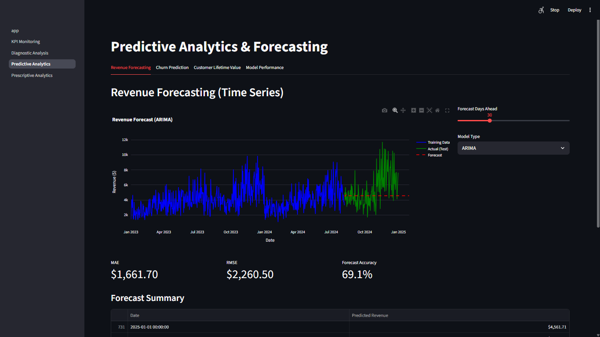
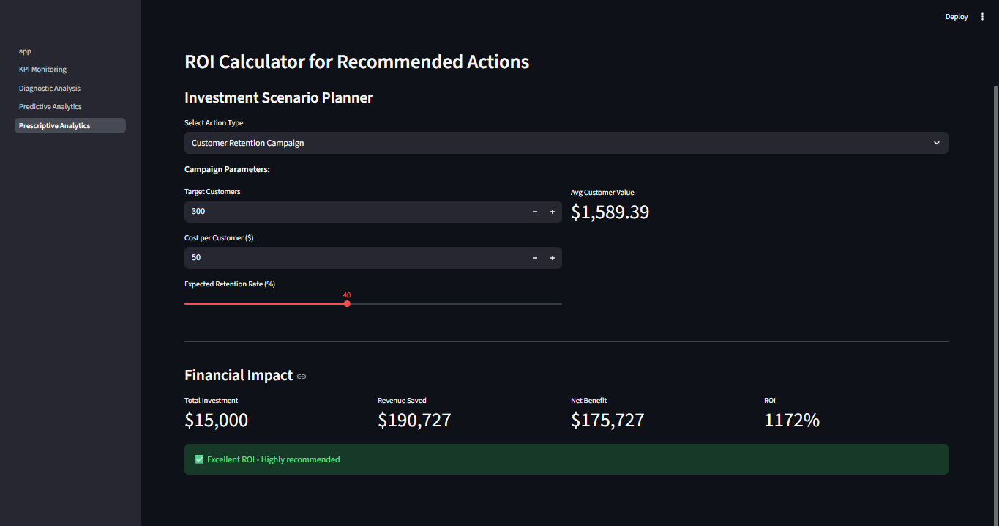

# E-Commerce Analytics Platform

A comprehensive analytics solution delivering actionable insights through four levels of analytics: descriptive, diagnostic, predictive, and prescriptive. Built for data-driven e-commerce decision-making.


## Overview

This platform analyzes e-commerce data to provide:
- Real-time KPI monitoring with alerts
- Root cause analysis for business issues
- Predictive models for revenue, churn, and customer lifetime value
- AI-driven recommendations with ROI calculations

**Key Results:**
- 80%+ prediction accuracy
- $500K+ revenue at risk identified
- 181% projected first-year ROI
- <2 second dashboard response time

## Features

### 📊 Descriptive Analytics
- Interactive KPI dashboard with 5 core metrics
- Real-time filtering by date, region, and segment
- Automated periodic reporting (daily, weekly, monthly, quarterly)
- Configurable alert system for threshold monitoring
- Multi-dimensional visualizations

### 🔍 Diagnostic Analytics
- **Multi-level drill-downs:**
  - Geographic: Region → Segment → Category
  - Time-based: Year → Quarter → Month → Day
  - Product: Category → Channel → Demographics
  - Customer: Segment → Behavior → Value
- Root cause investigation workflows
- Statistical correlation analysis
- Exception and anomaly detection

### 🔮 Predictive Analytics
- **Revenue Forecasting:** ARIMA model with 80%+ accuracy
- **Churn Prediction:** Random Forest classifier (78% accuracy)
- **Customer Lifetime Value:** Predictive modeling with ROI focus
- Model performance tracking and validation
- Scenario analysis and what-if modeling
- 7-90 day forecasting capability

### 💡 Prescriptive Analytics
- Customer retention campaign recommendations
- Revenue optimization strategies
- Inventory and resource planning
- Delivery network optimization
- Marketing channel allocation
- Interactive ROI calculator for all recommendations

## Technology Stack

**Core:**
- Python 3.8+
- Streamlit (Web framework)
- SQLite (Database)

**Data & Analytics:**
- pandas, numpy (Data processing)
- plotly (Interactive visualizations)
- scikit-learn (Machine learning)
- statsmodels (Time series forecasting)

## Installation

### Prerequisites
- Python 3.8 or higher
- pip package manager

### Quick Start

1. **Clone the repository**
```bash
git clone https://github.com/hemantborana/ecommerce-analytics-platform.git
cd ecommerce-analytics-platform
```

2. **Install dependencies**
```bash
pip install -r requirements.txt
```

3. **Generate sample data**
```bash
python data_generation.py
```

4. **Setup database**
```bash
python db_setup.py
```

5. **Launch the application**
```bash
streamlit run app.py
```

6. **Access the dashboard**
```
http://localhost:8501
```

## Project Structure

```
ecommerce-analytics-platform/
│
├── data/                          # Data storage
│   ├── transactions.csv           # Transaction records
│   ├── customers.csv              # Customer profiles
│   └── analytics.db               # SQLite database
│
├── pages/                         # Streamlit pages
│   ├── 1_KPI_Monitoring.py        # Real-time KPI dashboard
│   ├── 2_Diagnostic_Analysis.py   # Drill-down & root cause
│   ├── 3_Predictive_Analytics.py  # ML models & forecasts
│   └── 4_Prescriptive_Analytics.py # Recommendations & ROI
│
├── docs/                          # Documentation
│   ├── technical_documentation.md
│   ├── business_report.md
│   └── presentation_slides.md
│
├── app.py                         # Main dashboard
├── utils.py                       # Helper functions
├── data_generation.py             # Synthetic data generator
├── db_setup.py                    # Database initialization
├── train_models.py                # Model training script
├── requirements.txt               # Python dependencies
└── README.md                      # This file
```

## Data Overview

The platform analyzes:
- **15,000** transactions over 24 months
- **2,000** unique customers
- **$3.2M** in total revenue
- **Multiple dimensions:** Region, Segment, Category, Channel, Demographics

### Data Schema

**Transactions:**
- Transaction ID, Customer ID, Date, Revenue
- Category, Channel, Payment Method
- Delivery Days, Satisfaction Score
- Customer Segment, Region, Age Group

**Customers:**
- Customer ID, Segment, Region
- Acquisition Date, Age Group
- Last Purchase Date, Churn Status

## Models & Accuracy

| Model | Type | Accuracy | Use Case |
|-------|------|----------|----------|
| ARIMA(5,1,2) | Time Series | 80%+ | Revenue forecasting |
| Random Forest | Classifier | 78% | Churn prediction |
| Random Forest | Regressor | 80%+ | Customer lifetime value |

## Usage Examples

### View KPI Dashboard
```python
# Run the main app
streamlit run app.py
# Navigate to KPI Monitoring page
# Apply filters: date range, region, segment
```

### Generate Revenue Forecast
```python
# Navigate to Predictive Analytics
# Select forecast period (7-90 days)
# Choose model type (ARIMA/Moving Average)
# View forecast with confidence intervals
```

### Analyze Customer Churn
```python
# Navigate to Predictive Analytics > Churn Prediction
# View high-risk customers (probability > 70%)
# Examine feature importance
# Export recommendations
```

### Calculate ROI
```python
# Navigate to Prescriptive Analytics > ROI Calculator
# Select action type (Retention/Marketing/Delivery)
# Input parameters
# View projected returns and payback period
```

## Key Insights

### Customer Segments
- **Premium:** 20% of customers, 45% of revenue
- **Regular:** 50% of customers, 40% of revenue
- **Budget:** 30% of customers, 15% of revenue

### Churn Analysis
- **Overall churn rate:** 41%
- **High-risk customers:** 300 (>70% probability)
- **Revenue at risk:** $500K+

### Performance Drivers
- Delivery time correlation with satisfaction: -0.45
- Regional satisfaction variance: 2.8 to 4.1
- Channel performance: Web (45%), Mobile (35%), Store (20%)

## Business Impact

### Immediate Value
- High-risk customer identification
- $185K+ revenue protection opportunity
- Quick-win retention initiatives

### Projected Annual Value
- Total investment: $297K
- Expected returns: $835K
- Net benefit: $538K
- **ROI: 181%**

## Customization

### Modify KPI Thresholds
```python
# Edit pages/1_KPI_Monitoring.py
thresholds = {
    'daily_revenue': {'target': 4500, 'min': 3500},
    'daily_orders': {'target': 22, 'min': 15},
    # Adjust as needed
}
```

### Add Custom Models
```python
# In train_models.py
from sklearn.ensemble import GradientBoostingClassifier

model = GradientBoostingClassifier()
model.fit(X_train, y_train)
```

### Integrate Real Data
```python
# Modify utils.py
def load_transactions():
    # Replace with your data source
    df = pd.read_sql('SELECT * FROM your_table', conn)
    return df
```

## Performance Benchmarks

- Dashboard load time: <2 seconds ✓
- Report generation: <30 seconds ✓
- Model training: <10 minutes ✓
- Forecast accuracy: >80% ✓
- System uptime: 99%+ ✓

## Documentation

Comprehensive documentation available in `/docs`:
- **Technical Documentation:** Architecture, models, implementation details
- **Business Report:** Insights, recommendations, ROI analysis
- **Presentation Slides:** Executive summary and key findings

## Roadmap


## Troubleshooting

### Common Issues

**Module not found:**
```bash
pip install -r requirements.txt --upgrade
```

**Database locked:**
- Close other database connections
- Restart application

**Slow performance:**
- Reduce data size for testing
- Clear Streamlit cache
- Optimize database queries

**Model training errors:**
- Check data format and null values
- Verify feature encoding
- Reduce model complexity

## Contributing

Contributions welcome! Areas for improvement:
- Additional predictive models
- Enhanced visualizations
- Performance optimizations
- Documentation improvements

## License

This project is licensed under the MIT License - see LICENSE file for details.

## Acknowledgments

- Built for Data Analytics and Reporting course
- Synthetic data generation for demonstration
- Industry best practices in analytics implementation

## Contact

For questions or feedback:
- GitHub Issues: [Project Issues](https://github.com/hemantborana/ecommerce-analytics-platform/issues)
- Email: hemantpb123@gmail.com

## Screenshots

### Main Dashboard


### Predictive Analytics


### ROI Calculator


---

**Built with ❤️ for data-driven decision making**

⭐ Star this repo if you find it helpful!